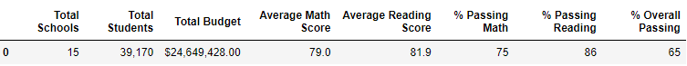
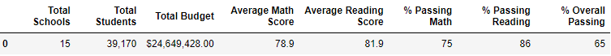
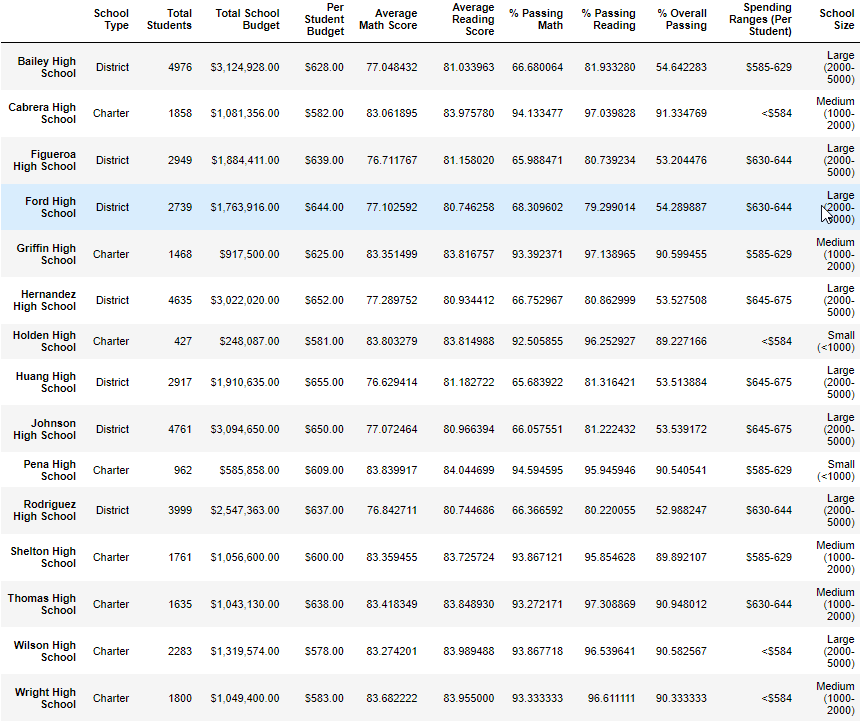
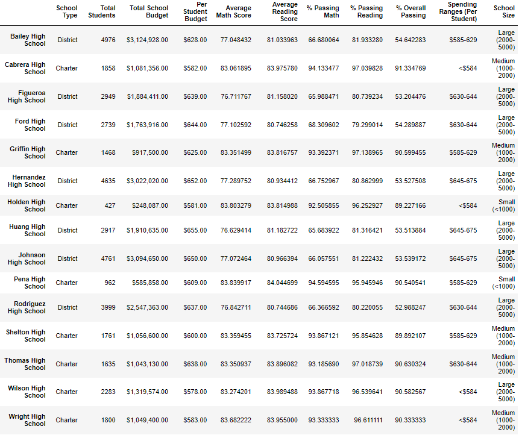
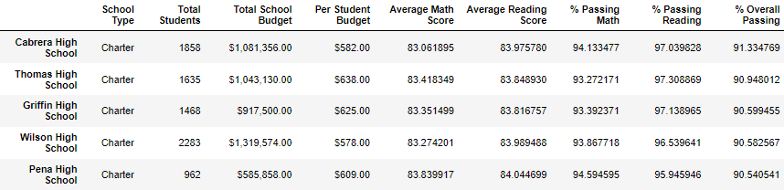
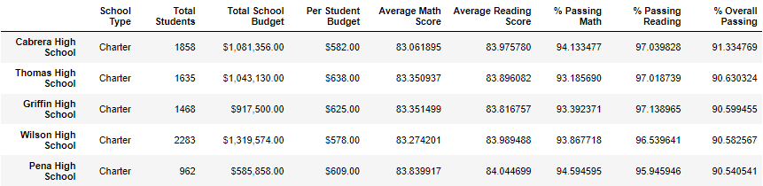

# school-district-analysis

## Overview
This analysis uses pandas in Jupyter Notebook to visualize relationships between student performance at 14 schools and several other variables: school size, type, and budget per student. In addition, it examines the impact of discounting untrustworthy data by removing the 9th grade scores from a school suspected of tampering with those grades, then analyzing the resulting changes to that school's overall performance.

## Results
### Impact to District Summary
At the district level, the impact is negligable: the average math score has been nudged slightly lower, but the passing percentages are unchanged. 

Note: in the dataframes displayed below, the scores and passing percentages have been corrected to exclude the 9th grade students from Thomas High School (the group whose grades showed evidence of tampering), but these students have not been removed from the total count of students. This split is deliberate and consistent throughout this analysis: while the scores and passing percentages at this high school reflect only the 10th-12th graders, removing the 9th graders from the overall student count would potentially impact other metrics calculated in this analysis (school size categorization and budget per student), further diminishing the accuracy of any metrics concerning Thomas High School.

Original dstrict summary

Corrected district summary
 

### Impact to School Summary

Here too, the impact of removing the fraudulent grades makes minimal changes to the metrics recorded for Thomas High SChool
- average math score decreases from 83.4 to 83.35
- average reading score increases from 83.8 to 83.9
- % passing math descreases from 93.3 to 93.1
- % passing reading decreases 97.3 to 97.0
- % overall passing decreases from 90.9 to 90.6

With such little gain, and penalties for academic dishonesty, one wonders why Thomas High School bothered to cheat at all!

Original school summary

Corrected school summary

### Impact to Relative Performance
Removing the altered grades does not change Thomas High School's relative performance: it remains the second-highest performing school in the district, though the gap between it and the third-ranking school is lessened.

### Impact to Specified Metrics
School district grades were analyzed along several different axes, both before and after the removal of the fraudulent scores. Here we can see impact to these metrics, including average scores by: grade and school, school spending, school size, and school type.\
- math and reading scores by grade are 
- scores by school spending
- scores by school size
- scores by school type

## Summary

Four changes!