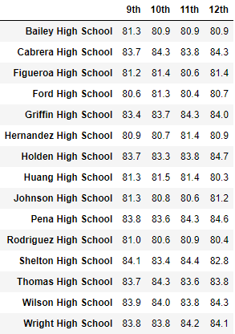
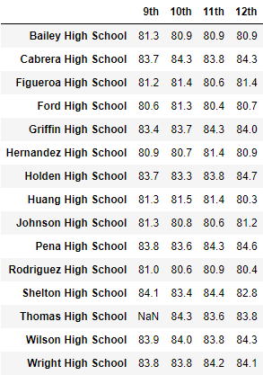

# school-district-analysis

## Overview
This analysis uses pandas in Jupyter Notebook to visualize relationships between student performance at 14 schools and several other variables: school size, type, and budget per student. In addition, it examines the impact of discounting untrustworthy data by removing the 9th grade scores from a school suspected of tampering with those grades, then analyzing the resulting changes to that school's overall performance.

## Results
### Impact to District Summary
At the district level, the impact is negligable: the average math score has been nudged slightly lower, but the passing percentages are unchanged. 

Note: in the dataframes displayed below, the scores and passing percentages have been corrected to exclude the 9th grade students from Thomas High School (the group whose grades showed evidence of tampering), but these students have not been removed from the total count of students. This split is deliberate and consistent throughout this analysis: while the scores and passing percentages at this high school reflect only the 10th-12th graders, removing the 9th graders from the overall student count would potentially impact other metrics calculated in this analysis (school size categorization and budget per student), further diminishing the accuracy of any metrics concerning Thomas High School.

Original dstrict summary

Corrected district summary
 

### Impact to School Summary

Here too, the impact of removing the fraudulent grades makes minimal changes to the metrics recorded for Thomas High SChool
- average math score decreases from 83.4 to 83.35
- average reading score increases from 83.8 to 83.9
- % passing math descreases from 93.3 to 93.1
- % passing reading decreases 97.3 to 97.0
- % overall passing decreases from 90.9 to 90.6

With such little gain, and penalties for academic dishonesty, one wonders why Thomas High School bothered to cheat at all!
- Original school summary

- Corrected school summary

### Impact to Relative Performance
Removing the altered grades does not change Thomas High School's relative performance: it remains the second-highest performing school in the district, though the gap between it and the third-ranking school is lessened.
- Top schools (original)

- Top schools (corrected)

### Impact to Specified Metrics
School district grades were analyzed along several different axes, both before and after the removal of the fraudulent scores. Here we can see impact to these metrics, including average scores by: grade and school, school spending, school size, and school type.
- Math and reading scores by grade, aside from the specific group whose scores were removed, are unaffected
    |Math by Grade|Math by Grade, Corrected|Reading by Grade|Reading by Grade, Corrected|
    |---|---|---|---|
    ||||
- Scores by school spending: Thomas High School is in the third spending range, $630-644, so this is where we would expect to see any changes. However, the difference in the school's scores is so small that it does not impact the group average
    - Scores by spending (original)

    - Scores by spending (corrected)

- Scores by school size: Thomas is a medium-sized school, but once more, thre removal of 461 students' scores is too small to impact the averaged scores the whole group. With or without the altered scores, small to medium-sized schools greatly outperform large schools
    - Scores by school size (original)

    - Scores by school size (corrected)

- Scores by school type is also unchanged. Charter schools continue to significantly outperform district schools in all metrics, even with the removal of the altered scores.
    - Scores by type (original)

    - Scores by type (corrected)

## Summary

Removing the altered test scored did make small changes to Thomas High School's math and reading scores, as well as the percentage of students passing math, reading, or both. However, the students whose scores were removed accounted for only 1% of the district's students, a change so small that it had no impact on the metrics of either the entire district or smaller subsets of schools grouped by spending, size, or type.